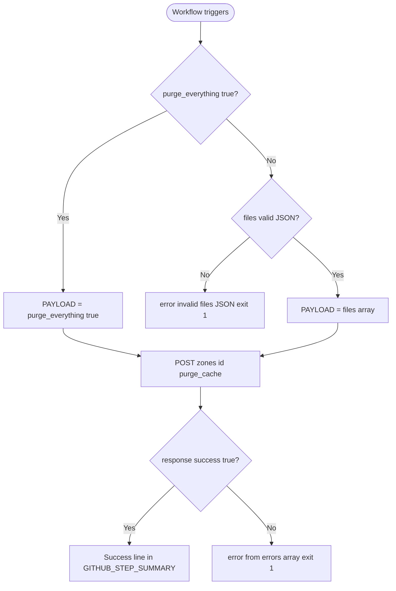

# Cloudflare Cache Purge — GitHub Action

[](https://github.com/features/actions)

A **composite** GitHub Action that invalidates Cloudflare CDN cache for a zone by calling the Cloudflare REST API:
`POST https://api.cloudflare.com/client/v4/zones/{zone_id}/purge_cache`.

You can **purge the entire zone** or **purge specific URLs** (absolute URLs as a JSON array). The action runs **bash only** and uses `curl` and `jq`, which are available on GitHub-hosted runners—no Node.js, Docker, or extra setup steps.

---

## Architecture overview

This repository is a single composite action defined in [`action.yml`](action.yml): one step runs a bash script that builds the JSON body, calls the purge endpoint, checks `.success`, and writes to the job summary.

### Repository structure

```
cloudflare-cache-purge-action/
├── action.yml      # Composite action (inputs + bash run)
├── AGENTS.md       # Instructions for AI agents and maintainers
├── LICENSE         # Apache License 2.0
└── README.md
```

### How it works



When `purge_everything` is not `true`, the `files` input must be a valid JSON array string. The script validates it with `jq` before calling the API. On success, a confirmation is appended to `$GITHUB_STEP_SUMMARY`. On API failure, messages from `.errors[].message` are surfaced and the step exits with a non-zero status.

---

## Prerequisites

- A [Cloudflare](https://www.cloudflare.com/) account with a **zone** for your domain.
- A **Cloudflare API token** with **Zone → Cache Purge** (or equivalent) permission, scoped to that zone.
- Your **Zone ID** (Cloudflare dashboard: domain overview).
- In GitHub: repository (or organization) **secrets** for the token and zone ID (see below).

---

## Inputs

| Input              | Required | Default   | Description                                                                 |
| ------------------ | -------- | --------- | --------------------------------------------------------------------------- |
| `api_token`        | Yes      | —         | Cloudflare API token with Zone:Cache Purge permission.                      |
| `zone_id`          | Yes      | —         | Cloudflare Zone ID of the domain to invalidate.                             |
| `purge_everything` | No       | `"false"` | Set to `"true"` to purge the entire zone cache.                             |
| `files`            | No       | `"[]"`    | JSON array of **absolute** URLs to purge. Ignored when purging everything. |

---

## Usage

Pin a [version tag](https://github.com/louisbrulenaudet/cloudflare-cache-purge-action/releases) (for example `@v1`) instead of moving `@main` in production workflows.

### Purge everything

Typical after a full site deploy when you want the whole zone cache cleared.

```yaml
- name: Purge Cloudflare cache
  uses: louisbrulenaudet/cloudflare-cache-purge-action@v1
  with:
    api_token: ${{ secrets.CF_API_TOKEN }}
    zone_id: ${{ secrets.CF_ZONE_ID }}
    purge_everything: "true"
```

### Purge specific URLs

Useful when only certain assets or pages changed.

```yaml
- name: Purge selected URLs
  uses: louisbrulenaudet/cloudflare-cache-purge-action@v1
  with:
    api_token: ${{ secrets.CF_API_TOKEN }}
    zone_id: ${{ secrets.CF_ZONE_ID }}
    files: '["https://example.com/", "https://example.com/assets/app.js"]'
```

YAML tip: keep `files` as a **single-quoted** string so the inner double quotes stay valid JSON.

### Example workflow: deploy then purge

Illustrative pattern with two jobs. Replace the `deploy` job with your real build/deploy steps (Pages, Workers, S3, etc.).

```yaml
name: Deploy and purge cache

on:
  push:
    branches: [main]

jobs:
  deploy:
    runs-on: ubuntu-latest
    steps:
      - uses: actions/checkout@v4
      # ... your build and deploy steps ...

  purge-cache:
    needs: deploy
    runs-on: ubuntu-latest
    steps:
      - name: Purge Cloudflare cache
        uses: louisbrulenaudet/cloudflare-cache-purge-action@v1
        with:
          api_token: ${{ secrets.CF_API_TOKEN }}
          zone_id: ${{ secrets.CF_ZONE_ID }}
          purge_everything: "true"
```

---

## Secrets and permissions setup

### 1. Create a Cloudflare API token

1. Open the Cloudflare dashboard → **My Profile** → **API Tokens** → **Create Token**.
2. Use a template like **Edit zone DNS** only if it includes **Cache Purge**, or create a custom token with:
   - **Permissions:** Zone → **Cache Purge** → *Edit* (or the narrowest option that allows purge for your zone).
   - **Zone Resources:** Include → Specific zone → your domain.
3. Create the token and copy it once; store it as a GitHub secret.

See Cloudflare’s documentation: [Cache Purge](https://developers.cloudflare.com/cache/how-to/purge-cache/) and [API tokens](https://developers.cloudflare.com/fundamentals/api/get-started/create-token/).

### 2. Add GitHub secrets

In your repository: **Settings** → **Secrets and variables** → **Actions** → **New repository secret**.

| Secret name     | Value                                      |
| --------------- | ------------------------------------------ |
| `CF_API_TOKEN`  | The Cloudflare API token from step 1.      |
| `CF_ZONE_ID`    | The Zone ID from the domain overview page. |

Reference them in workflows as `${{ secrets.CF_API_TOKEN }}` and `${{ secrets.CF_ZONE_ID }}`.

---

## Error handling

- **Invalid `files` JSON:** If `purge_everything` is not `true` and `files` is not valid JSON, the action emits `::error::The 'files' input is not valid JSON...` and exits with code `1` before calling the API.
- **API error:** If the response does not have `success: true`, the action collects `.errors[].message`, emits `::error::Cloudflare cache purge failed — …` (visible in the job log), appends a failure line to **`GITHUB_STEP_SUMMARY`**, and exits with code `1` so the job fails.

---

## License

This project is licensed under the **Apache License 2.0** — see [LICENSE](LICENSE).
